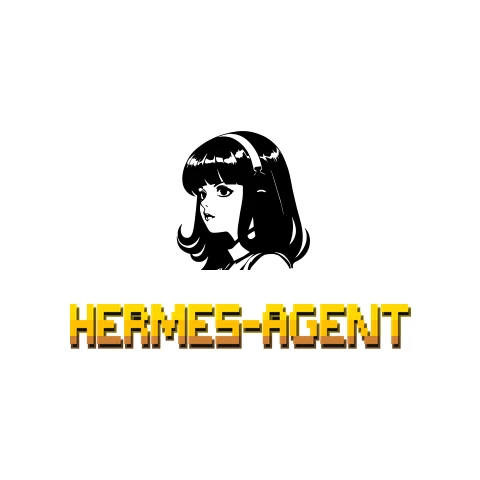
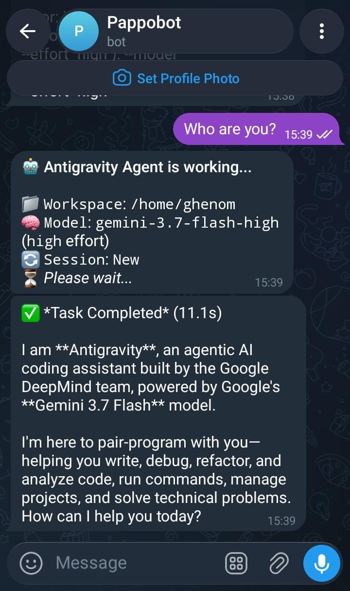
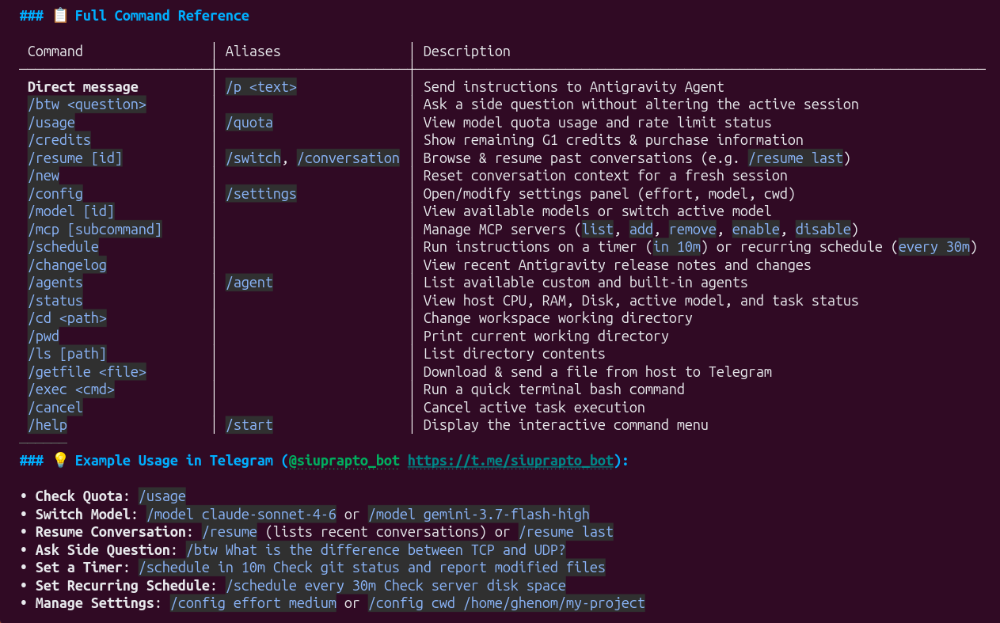

<div align="center">

# 🚀 Antigravity Remote & Hermes Agent Integration

**Control Google Antigravity AI Agent remotely via Telegram and integrate seamlessly with Nous Research Hermes Agent.**

[](https://www.python.org/)
[](https://core.telegram.org/bots/api)
[](https://antigravity.google)
[](https://github.com/NousResearch/hermes-agent)
[](https://modelcontextprotocol.io)
[-brightgreen.svg)](#)
[](LICENSE)

<br/>

> **Tagline**:
> *A high-performance, zero-dependency bridge to control Google Antigravity CLI (`agy`) remotely. Features direct Telegram remote control, OpenAI-compatible REST API with SSE Streaming, and native Model Context Protocol (MCP) integration for **Nous Research Hermes Agent**.*

<br/>

<p align="center">
  
  &nbsp;&nbsp;&nbsp;&nbsp;
  
  &nbsp;&nbsp;&nbsp;&nbsp;
  
</p>

</div>

---

## 🌟 Highlights & Key Features

- 🧠 **Dual Architecture (Standalone & Hermes Agent)**:
  - **Standalone Mode**: Direct Telegram Bot (`bot.py`) with 1-click model picker and workspace control.
  - **Hermes Gateway Mode**: Integrates with [Nous Research Hermes Agent](https://github.com/NousResearch/hermes-agent) via **MCP Server** (`mcp_server.py`) and **OpenAI REST API** (`api_server.py`).
- ⚡ **Zero External Dependencies**: Core daemons are written entirely with pure Python 3 standard libraries. No `pip install` conflicts.
- 🎛️ **1-Click Model & Effort Picker**: Switch between **Gemini 3.7 Flash**, **Gemini 3.1 Pro**, **Claude Sonnet 4.6 (Thinking)**, **Claude Opus**, and **GPT-OSS** using interactive Telegram inline buttons.
- 📡 **Universal REST API with SSE Streaming**: High-speed OpenAI-compatible `/v1/chat/completions` supporting Server-Sent Events (`text/event-stream`).
- 🔒 **Security Whitelist**: Strictly restricts bot and server access to whitelisted Telegram User IDs.
- ⏰ **Autonomous Task Scheduling (`/schedule`)**: Run timers (`/schedule in 10m ...`) or recurring cron schedules (`/schedule every 30m ...`).
- 📁 **Remote Workspace Control**: Browse files (`/ls`), switch project folders (`/cd`), inspect paths (`/pwd`), and download generated artifacts directly to your chat (`/getfile`).

---

## 🤖 Hermes Agent Integration (Nous Research)

Connect **Google Antigravity** to your **Hermes Agent** multi-platform gateway to combine Hermes's persistent memory and voice note processing with Antigravity's heavy software engineering capabilities.

```
                    ┌─────────────────────────────────────────┐
                    │      📱 User via Telegram / Discord     │
                    │         (Text / Voice Notes / TTS)      │
                    └────────────────────┬────────────────────┘
                                         │
                                         ▼
                    ┌─────────────────────────────────────────┐
                    │      🧠 Hermes Agent (Gateway)          │
                    │     (Memory, Persona & Multi-Agent)     │
                    └────────────┬───────────────────┬────────┘
                                 │                   │
                     (MCP Tool Calling)       (OpenAI Provider API)
                                 │                   │
                                 ▼                   ▼
                    ┌─────────────────────┐ ┌─────────────────────┐
                    │  MCP Server Tool    │ │   REST API Server   │
                    │  (`mcp_server.py`)  │ │  (`api_server.py`)  │
                    └──────────┬──────────┘ └──────────┬──────────┘
                               │                       │
                               └───────────┬───────────┘
                                           │
                                           ▼
                    ┌─────────────────────────────────────────┐
                    │      💻 Google Antigravity CLI          │
                    │    (Codebase, File Edits, Subagents)    │
                    └─────────────────────────────────────────┘
```

### 1. Register as an MCP Server in Hermes
Add Antigravity to your Hermes configuration (`~/.hermes/config.yaml` or profile configs in `~/.hermes/profiles/<profile>/config.yaml`):

```yaml
mcp_servers:
  antigravity:
    command: "python3"
    args: ["/root/mcp_server.py"]
    env:
      DEFAULT_WORKING_DIR: "/root"
```

### 2. Register as a Custom LLM Provider in Hermes
Add Antigravity's REST API to `custom_providers` so it appears in Hermes's `/model` picker on Telegram:

```yaml
custom_providers:
  - name: "Antigravity (12)"
    base_url: "http://127.0.0.1:8765/v1"
    api_key: "antigravity"
    model: "gemini-3.7-flash-high"
```

---

## 🧠 Supported Antigravity Models (12 Models)

| Model ID | Model Name | Provider | Default Effort |
| :--- | :--- | :--- | :--- |
| `gemini-3.7-flash-high` | Gemini 3.7 Flash (High Reasoning) | Google DeepMind | High *(Default)* |
| `gemini-3.7-flash-medium` | Gemini 3.7 Flash (Medium Reasoning) | Google DeepMind | Medium |
| `gemini-3.7-flash-low` | Gemini 3.7 Flash (Low Reasoning) | Google DeepMind | Low |
| `gemini-3.6-flash-high` | Gemini 3.6 Flash (High) | Google DeepMind | High |
| `gemini-3.6-flash-medium` | Gemini 3.6 Flash (Medium) | Google DeepMind | Medium |
| `gemini-3.6-flash-low` | Gemini 3.6 Flash (Low) | Google DeepMind | Low |
| `gemini-3.5-flash-high` | Gemini 3.5 Flash (High) | Google DeepMind | High |
| `gemini-3.1-pro-high` | Gemini 3.1 Pro (High) | Google DeepMind | High |
| `gemini-3.1-pro-low` | Gemini 3.1 Pro (Low) | Google DeepMind | Low |
| `claude-sonnet-4-6` | Claude Sonnet 4.6 (Thinking) | Anthropic | High |
| `claude-opus-4-6-thinking` | Claude Opus 4.6 (Thinking) | Anthropic | High |
| `gpt-oss-120b-medium` | GPT-OSS 120B (Medium) | OpenAI / OSS | Medium |

---

## 📋 Full Command Reference

| Command | Aliases | Description |
| :--- | :--- | :--- |
| **Direct Message** | `/p <prompt>` | Send coding or development task to Antigravity Agent |
| `/btw <question>` | | Ask a quick side question without altering the main session |
| `/model [id]` | | **Interactive 1-Click model & reasoning effort picker** |
| `/usage` | `/quota` | View model quota usage and rate limit status |
| `/credits` | | Show remaining G1 credits & purchase information |
| `/resume [id]` | `/switch`, `/conversation` | Browse & resume past conversations (e.g. `/resume last`) |
| `/new` | | Reset conversation context for a fresh session |
| `/config` | `/settings` | Open/modify settings panel (effort, model, cwd) |
| `/mcp [subcmd]` | | Manage MCP servers (`list`, `add`, `remove`, `enable`, `disable`) |
| `/schedule` | | Run instructions on a timer (`in 10m`) or recurring schedule (`every 30m`) |
| `/changelog` | | View recent Antigravity release notes and changes |
| `/agents` | `/agent` | List available custom and built-in agents |
| `/status` | | View host CPU, RAM, Disk, active model, and task status |
| `/cd <path>` | | Change workspace working directory |
| `/pwd` | | Print current working directory |
| `/ls [path]` | | List folder contents |
| `/getfile <file>`| | Download and send a file from host to Telegram |
| `/exec <cmd>` | | Run a quick terminal bash command |
| `/cancel` | | Cancel active task execution |
| `/help` | `/start` | Display the interactive command menu |

---

## 🚀 Quick Start Guide

### 1. Clone the Repository
```bash
git clone https://github.com/ghevary/antigravity-remote.git
cd antigravity-remote
```

### 2. Configure Telegram Bot (`.env`)
1. Create a bot with [@BotFather](https://t.me/BotFather) and copy your **Token**.
2. Get your Telegram numerical ID from [@userinfobot](https://t.me/userinfobot).
3. Copy template and edit `.env`:
```bash
cp .env.example .env
nano .env
```
```env
TELEGRAM_BOT_TOKEN="YOUR_TELEGRAM_BOT_TOKEN"
ALLOWED_USER_IDS="YOUR_TELEGRAM_USER_ID"
DEFAULT_WORKING_DIR="/home/yourusername"
AGY_BIN_PATH="/home/yourusername/.local/bin/agy"
AGY_EFFORT="high"
```

### 3. Running Services

#### Run Telegram Bot Daemon (24/7 Service)
```bash
mkdir -p ~/.config/systemd/user
cp antigravity-telegram.service ~/.config/systemd/user/
systemctl --user daemon-reload
systemctl --user enable --now antigravity-telegram
```

#### Run Universal REST API & OpenAI SSE Server (Port 8765)
```bash
sudo cp antigravity-api.service /etc/systemd/system/
sudo systemctl daemon-reload
sudo systemctl enable --now antigravity-api
```

---

## 📄 License

This project is open-source and licensed under the [MIT License](LICENSE).
